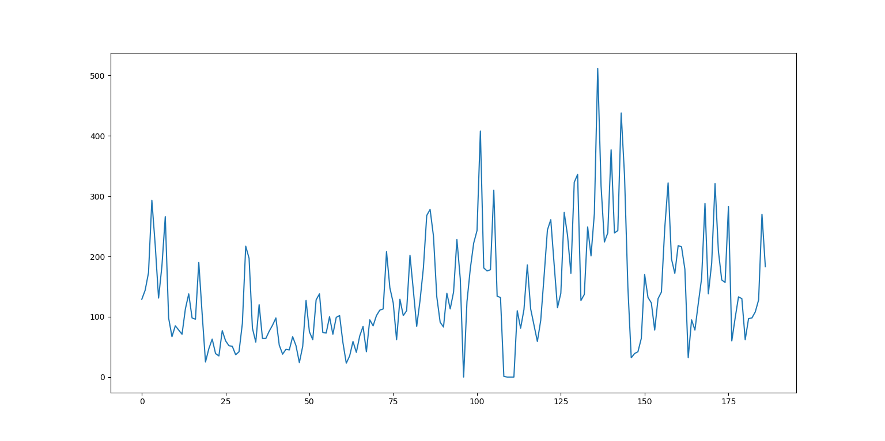

# Fourier-on-Sequences
The python file fourier_reconstruction.py reconstructs the sequence of numbers using a lossy fourier method(the reconstruct function inside the fourier_reconstruction.py), 
The reconstuct function takes takes a sequence of numbers, calculates its fourier transform, removes high frequencies and takes inverse fourier transform to reconstruct the lossy sequence.

We then plot the mean l2 loss of reconstruction for different size of sequences(for sequences of length 5 and above).

